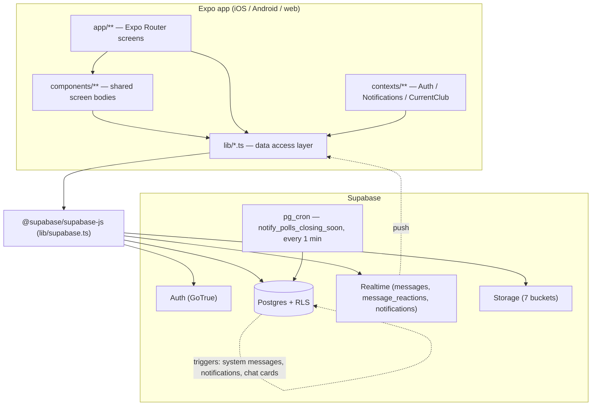

# Architecture

How ClubChat is put together: a single Expo/React Native client talking directly to Supabase, with all data access funnelled through `lib/*.ts` and all scope-specific UI built from one generic "channel" abstraction.

## Overview

ClubChat is a **two-tier system**. There is no application server of our own: the Expo app holds the entire UI and all business-logic-that-isn't-a-permission, and Supabase (Postgres + Auth + Realtime + Storage + pg_cron) holds the data, the permissions (RLS), and the event fan-out (triggers). The client is a privileged-nothing consumer — it authenticates as `authenticated` and every read/write it issues is re-checked by row-level security.



## Key files

| Path | Responsibility |
| --- | --- |
| `app/_layout.tsx` | Font gate, provider nesting, auth-guard redirect state machine, root `Stack` |
| `app/index.tsx` | Spinner placeholder at `/` — exists only so Expo Router doesn't render "Unmatched Route" before the guard fires |
| `lib/supabase.ts` | The single `supabase` client instance; throws at import if env vars are missing |
| `types/database.ts` | Hand-written `Database` generic + every enum union used app-wide |
| `contexts/AuthProvider.tsx` | Session state, `signIn`/`signUp`/`signOut`, 5s `getSession()` timeout |
| `contexts/NotificationsProvider.tsx` | Live `unreadCount` for the tab badge, realtime-subscribed |
| `contexts/CurrentClubProvider.tsx` | "Which club is the user inside", readable from outside that club's Stack |
| `constants/theme.ts` | Design tokens — see [Design system](08-design-system.md) |
| `app.json` | Expo config: `scheme: "clubchat"` (deep links), bundle IDs, plugins |

## Layering rule

```
screen (app/**)  →  shared component (components/**)  →  lib/*.ts  →  supabase-js
```

**Screens never build raw Supabase queries.** Every table read/write, RPC call, and Storage operation lives in a `lib/*.ts` module as a plain exported async function returning app-shaped camelCase objects, never raw `snake_case` rows. See [Data access layer](05-data-access-layer.md).

Two deliberate exceptions exist and are the only ones:

| Exception | Why |
| --- | --- |
| `app/(tabs)/clubs/[clubId]/_layout.tsx` | Fetches membership + club + channel in one `Promise.all` at layout mount; no `lib/` module owns "the club context bundle" |
| `app/(tabs)/clubs/[clubId]/race/[raceId]/_layout.tsx`, `race/[raceId]/index.tsx` | One-off `race_members` / `race_join_requests` existence checks inline |

Anything new should add a `lib/` function rather than widen these.

## Why Supabase (and not Firebase)

The domain is **relational all the way down**: `Club → ClubMember → Race → RaceMember → RaceCarGroup → RaceCarGroupMember`, with permissions that are themselves joins ("can this user read this poll?" = "is there a `race_members` row for them on the race this poll is scoped to?"). Postgres + RLS expresses that directly; a document store would force either denormalized permission copies on every document or a server tier to enforce them. Supabase additionally bundles Auth, Realtime, and Storage, so no separate services need standing up. See [Security & RLS](02-security-rls.md).

## Dependency inventory

Versions as pinned in `package.json`. Expo SDK 57; **read `https://docs.expo.dev/versions/v57.0.0/` before writing Expo code** (`AGENTS.md`).

| Package | Version | Used for |
| --- | --- | --- |
| `expo` | `~57.0.8` | SDK baseline |
| `expo-router` | `~57.0.8` | File-based routing, `Stack`/`Tabs`, deep links |
| `react-native` | `0.86.0` | — |
| `react` / `react-dom` | `19.2.3` | — |
| `react-native-web` | `^0.21.2` | Web target (dev smoke-testing lives here) |
| `@supabase/supabase-js` | `^2.110.0` | Sole backend client |
| `@react-native-async-storage/async-storage` | `2.2.0` | Supabase auth session persistence |
| `react-native-url-polyfill` | `^3.0.0` | Required by supabase-js on RN |
| `expo-blur` | `~57.0.2` | Glass chat/Highlights headers, pinned strip |
| `expo-linear-gradient` | `~57.0.1` | Sent-message bubble fill |
| `expo-image-picker` | `~57.0.6` | Native photo/camera picking |
| `expo-document-picker` | `~57.0.1` | Native document attachment |
| `expo-file-system` | `~57.0.1` | `legacy` API — base64 read for native uploads (`lib/uploadBody.ts`) |
| `base64-arraybuffer` | `^1.0.2` | Decodes that base64 into an `ArrayBuffer` |
| `expo-clipboard` | `~57.0.1` | Copy join link |
| `expo-linking` | `~57.0.4` | `clubchat://` deep links |
| `expo-font` + `@expo-google-fonts/{anton,archivo-narrow,inter}` | `~57.0.0` / `^0.4.2` | Three design-system families |
| `@expo/vector-icons` | `^15.0.2` | MaterialIcons throughout |
| `react-native-safe-area-context` | `~5.7.0` | `useSafeAreaInsets` for the custom chat header |
| `react-native-screens`, `react-native-gesture-handler` | `~4.26.0`, `~2.32.0` | Navigation primitives |
| `jest-expo` / `jest` / `typescript` (dev) | `~57.0.2` / `~29.7.0` / `~6.0.3` | See [Testing & CI](09-testing-and-ci.md) |

No state-management library, no data-fetching library, no linter, no formatter. State is `useState` + `useFocusEffect`; caching is deliberately absent (every screen refetches on focus).

## Providers and the root tree

`app/_layout.tsx` renders, outermost first:

```
SafeAreaProvider
└─ StatusBar
└─ AuthProvider              — session; everything below can assume useAuth()
   └─ NotificationsProvider  — needs session.user.id for the badge subscription
      └─ CurrentClubProvider — no data deps; nested last, read by the tab bar
         └─ RootNavigator    — the auth guard + root Stack
```

Ordering is load-bearing: `NotificationsProvider` calls `useAuth()`, so it must be inside `AuthProvider`. `CurrentClubProvider` is pure state and could sit anywhere below, but is placed inside so the whole app (including the tab bar in `app/(tabs)/_layout.tsx`) can read it.

| Provider | Exposes | Written by | Read by |
| --- | --- | --- | --- |
| `AuthProvider` | `session`, `initializing`, `signIn`, `signUp`, `signOut` | `supabase.auth` listener | Everywhere |
| `NotificationsProvider` | `unreadCount`, `refetch()`, `markAllRead()` | `subscribeToNotifications(userId, refetch, "badge")` | `(tabs)/_layout.tsx` badge, `components/ChatScreen.tsx` (post-`markChannelRead` refetch), `(tabs)/notifications.tsx` |
| `CurrentClubProvider` | `currentClub: {clubId,name,isAdmin} \| null` | **Only** `clubs/[clubId]/_layout.tsx` — set on load, cleared on unmount | `(tabs)/calendar.tsx`, Clubs-tab `tabPress` listener |

`AuthProvider` carries one defensive measure worth keeping: `getSession()` is raced against a 5-second timeout that falls back to "no session", so a hung call can never strand the app on the initial spinner.

Component-level props and the shared screen bodies are documented in [Component inventory](04-component-inventory.md); providers are documented **here**, not there.

## Auth guard state machine

`RootNavigator` in `app/_layout.tsx`:

```ts
const inAuthGroup = segments[0] === "(auth)";
const inTabsGroup = segments[0] === "(tabs)";

if (!session && !inAuthGroup) router.replace("/(auth)/sign-in");
else if (session && !inTabsGroup) router.replace("/(tabs)/clubs");
```

| State | `segments[0]` | Action |
| --- | --- | --- |
| `initializing` | any | Render spinner, no redirect |
| No session | `(auth)` | Stay |
| No session | anything else (incl. bare `/`) | → `/(auth)/sign-in` |
| Session | `(tabs)` | Stay |
| Session | anything else (incl. bare `/`) | → `/(tabs)/clubs` |

The `!inTabsGroup` form (rather than `inAuthGroup`) is what makes the bare `/` case terminate — the two-branch version it replaced left `/` matching neither branch and hanging on a spinner forever. Fonts gate the tree above this: `RootLayout` returns a spinner until all three families report loaded, so no screen ever renders with system fonts.

## The scoped mini-club pattern

**This is the single most important structural idea in the codebase.** A Race and an Eboard channel are not new concepts — they are a Club's own shape (membership + a chat channel + sub-features) nested one level down. The product reasoning behind treating them that way is in [Races](../PRD/06-races.md) and [Eboard](../PRD/07-eboard.md). The schema encodes this with one generic `channels` table carrying a nullable `race_id` and a nullable `eboard_channel_id`; the client encodes it with one set of shared screen components parametrized by scope.

| Concern | Club | Race | Eboard |
| --- | --- | --- | --- |
| Channel row | `race_id IS NULL AND eboard_channel_id IS NULL` | `race_id = <race>` | `eboard_channel_id = <channel>` |
| Layout context | `useClub()` | `useRace()` | `useEboard()` |
| Chat | `components/ChatScreen.tsx` | same | same |
| Highlights | `components/HighlightsScreen.tsx` | same | same |
| Gallery | `components/GalleryScreen.tsx` | same | same |
| Roster | `components/MembersScreen.tsx` | same | same |
| Polls | `PollsListScreen` / `PollCreateScreen` / `PollDetailScreen` with `scope: {type:"club"…}` | `{type:"race"…}` | `{type:"eboard"…}` |
| Scope-only features | Routines, Calendar/Events, News | Meet Information, Car Groups | Meetings |

Every route file for chat/highlights/gallery/polls in all three scopes is a **thin wrapper** — typically under 40 lines — that reads its layout context and passes paths down. Adding a fourth scope would mean: a table + nullable FK on `channels`, an RLS branch in `is_channel_member`/`is_channel_admin`, a layout with its own context hook, and wrappers. No shared component would change.

## Invariants

1. **Screens do not call `supabase` directly** except the two layout files named above. New data access goes in a `lib/*.ts` module.
2. **There is exactly one Supabase client** (`lib/supabase.ts`). Never construct a second one; never put the secret key anywhere in this repo.
3. **`lib/` functions return camelCase app types**, never raw Postgres rows, and `throw` on error rather than returning `{data, error}`.
4. **Provider order in `app/_layout.tsx` is Auth → Notifications → CurrentClub.** Notifications depends on Auth.
5. **`CurrentClubProvider` has exactly one writer**, `clubs/[clubId]/_layout.tsx`. Any other writer would let it drift out of sync with the actual navigation state.
6. **The auth guard's second branch must test `!inTabsGroup`, not `inAuthGroup`** — see the state machine above.
7. **Club/Race/Eboard chat mount the same `ChatScreen`.** A feature added to one is added to all three, or it is a prop.
8. **`types/database.ts` must keep `Row`/`Insert`/`Update`/`Relationships` per table and `Tables`/`Views`/`Functions` per schema** — omitting any silently resolves query types to `never` instead of erroring.

## Extension points

| Goal | Do this |
| --- | --- |
| New backend-touching feature | Add `lib/<feature>.ts` with plain async functions → add screens under the right scope → add a migration for the table + RLS |
| New scope (a fourth mini-club) | Nullable FK on `channels`, RLS branch in `is_channel_member`/`is_channel_admin`, a `_layout.tsx` exposing a context hook, thin wrappers around the shared components |
| New cross-cutting app state | A `contexts/` provider nested under `AuthProvider`, following `CurrentClubProvider`'s single-writer discipline |
| New push/scheduled behavior | Prefer a Postgres trigger or a pg_cron job over client polling — see [Realtime & notifications](06-realtime-and-notifications.md) |

## Known gaps

- **No error monitoring.** `lib/reportError.ts` shows the user an alert and drops the error on the floor; nothing is reported anywhere.
- **No caching layer.** Every screen refetches on focus. Fine at current scale, but there is no deduplication or stale-while-revalidate anywhere.
- **`types/database.ts` is hand-written** and can silently drift from `supabase/migrations/`. Regenerate with `npx supabase gen types typescript` once a hosted project exists.
- **No push notifications and no OTA updates.** `expo-notifications` and `expo-updates` are not installed; the `notifications` table already computes the `body`/`target_path` a payload would need.
- **Web is a dev/testing target, not a shipped one.** Several branches (`Platform.OS === "web"` confirm dialogs, `lib/pickImageOnWeb.ts`) exist purely so the Playwright smoke-test flow works.
- **Light mode only.** `constants/theme.ts` has no dark variant, and `app.json` pins `userInterfaceStyle: "light"`.
