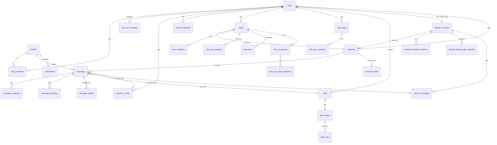

# Data model

Every Postgres table, column, enum, constraint, index and cascade in ClubChat, read from `supabase/migrations/0001`–`0079`.

## Overview

28 tables, 6 enums, one schema (`public`). Three structural ideas carry most of the weight:

1. **One generic `channels` table, three scopes.** A channel row is club-scoped by default; a non-null `race_id` makes it race-scoped, a non-null `eboard_channel_id` makes it Eboard-scoped. `messages` / `message_reactions` / `message_mentions` / `message_reports` / `channel_reads` all hang off `channels` and therefore work identically in all three scopes with zero duplication. Partial unique indexes enforce "exactly one channel per club / per race / per Eboard".
2. **Nullable scope columns instead of per-scope tables.** `polls` repeats the same trick (`club_id` always set, plus optional `race_id` / `eboard_channel_id`). `club_id` stays `not null` on every scoped row so club-level filtering never needs a join.
3. **Denormalized columns where RLS can't do column-level filtering.** `poll_options.vote_count` (trigger-maintained) exists because a private poll's `poll_votes` rows are row-hidden, and RLS cannot expose "count" while hiding "who". `race_car_group_members.race_id` and `message_reports.channel_id` are denormalized so a `unique` constraint / an RLS check can be written without a subquery.

Related: [Security & RLS](02-security-rls.md) · [Migrations](11-migrations.md) · [Data access layer](05-data-access-layer.md) · PRD [Clubs & membership](../PRD/02-clubs-and-membership.md)

## Entity relationships



## Enums

| Enum | Values | Added |
| --- | --- | --- |
| `club_role` | `admin`, `member` (0001); `owner` (0042) | Owner is a strict superset of Admin for every `is_club_admin()`-gated policy |
| `calendar_event_type` | `race`, `practice`, `team_bonding`, `volunteer`, `other` | 0001. The `race` value is a calendar label only — **no relationship to the `races` table** |
| `club_join_policy` | `open`, `request` | 0006. There is no "invite only" tier; `invite_code` is an orthogonal always-instant side channel |
| `message_type` | `text`, `photo`, `announcement` (0001); `system` (0007); `document` (0066); `poll`, `event` (0069); `meeting` (0076) | 8 values |
| `routine_activity_type` | `run`, `trail_run`, `bike`, `swim`, `strength`, `hybrid_fitness`, `indoor_climb`, `bouldering`, `xc_ski`, `other` | 0015. 10 values |
| `notification_type` | `club_join_request`, `race_join_request`, `eboard_join_request`, `request_approved`, `request_denied`, `member_added`, `member_removed`, `role_changed`, `poll_created`, `event_created`, `race_created`, `meeting_created`, `announcement` (0031); `poll_closing_soon` (0047); `chat_caught_up` (0051); `mentioned` (0055); `news_post_created` (0064); `car_group_incharge_left` (0073) | 18 values |

**Join-request status is not an enum.** All three `*_join_requests` tables use `status text not null default 'pending' check (status in ('pending','approved','denied'))`. So does `notifications.resolved_outcome` (`check in ('approved','denied')`, nullable). Widening a check constraint is a plain `alter table`; widening an enum needs its own migration file (see [Migrations](11-migrations.md)).

## Identity & clubs

### `profiles`

One row per `auth.users`, created by the `handle_new_user` trigger on signup.

| Column | Type | Null | Default | Notes |
| --- | --- | --- | --- | --- |
| `id` | uuid | no | — | PK, FK → `auth.users(id)` **on delete cascade** |
| `full_name` | text | no | `''` | |
| `avatar_url` | text | yes | — | Public URL into the `avatars` bucket, cache-busted with `?t=` |
| `bio` | text | no | `''` | 0009 |
| `city` | text | no | `''` | 0011 |
| `date_of_birth` | date | yes | — | 0011 |
| `school` | text | no | `''` | 0011 |
| `created_at` | timestamptz | no | `now()` | |

~15 FKs point at `profiles.id` and most have **no** `on delete` action, which is exactly why account deletion anonymizes rather than hard-deletes (see `delete_account()` in [Security & RLS](02-security-rls.md)).

### `clubs`

| Column | Type | Null | Default | Notes |
| --- | --- | --- | --- | --- |
| `id` | uuid | no | `gen_random_uuid()` | PK |
| `name` | text | no | — | Searchable via `search_clubs(query)` |
| `description` | text | yes | — | |
| `sport` | text | yes | — | |
| `invite_code` | text | no | `substr(md5(gen_random_uuid()::text),1,8)` | **unique**, always lowercase; wrapped into a `clubchat://` link by `lib/clubs.ts` |
| `created_by` | uuid | no | — | FK → `profiles(id)`, no cascade. Historical only since 0043 — authority lives in the `owner` role |
| `join_policy` | club_join_policy | no | `'request'` | 0006 |
| `avatar_url` | text | yes | — | 0013 |
| `created_at` | timestamptz | no | `now()` | |

`on_club_created` (`handle_new_club`) inserts the owner's `club_members` row, the main `channels` row, and — since 0072 — an `eboard_channels` row, in that order.

### `club_members`

| Column | Type | Null | Default | Notes |
| --- | --- | --- | --- | --- |
| `club_id` | uuid | no | — | FK → `clubs` **cascade** |
| `user_id` | uuid | no | — | FK → `profiles` **cascade** |
| `role` | club_role | no | `'member'` | |
| `joined_at` | timestamptz | no | `now()` | |

- PK `(club_id, user_id)`
- Index on `(user_id)` — powers "my clubs"
- **`one_owner_per_club`**: `create unique index ... on club_members (club_id) where role = 'owner'` (0043). Checked per-statement, not deferred — which is why `transfer_ownership()` demotes before it promotes.

### `club_join_requests`

| Column | Type | Null | Default | Notes |
| --- | --- | --- | --- | --- |
| `id` | uuid | no | `gen_random_uuid()` | PK |
| `club_id` | uuid | no | — | FK → `clubs` cascade |
| `user_id` | uuid | no | — | FK → `profiles` cascade |
| `status` | text | no | `'pending'` | check `pending`/`approved`/`denied` |
| `created_at` | timestamptz | no | `now()` | |
| `decided_at` | timestamptz | yes | — | |
| `decided_by` | uuid | yes | — | FK → `profiles` |

`unique (club_id, user_id)` — a re-request after denial is an `on conflict do update` back to `pending`, which is what the notification trigger's `insert or update of status ... when (new.status = 'pending')` catches.

## Chat

### `channels` — the deliberately generic table

| Column | Type | Null | Default | Notes |
| --- | --- | --- | --- | --- |
| `id` | uuid | no | `gen_random_uuid()` | PK |
| `club_id` | uuid | no | — | FK → `clubs` cascade. Set on **every** channel regardless of scope |
| `race_id` | uuid | yes | — | 0016. FK → `races` cascade |
| `eboard_channel_id` | uuid | yes | — | 0017. FK → `eboard_channels` cascade |
| `created_at` | timestamptz | no | `now()` | |

Scope is derived, never stored as a type column:

| `race_id` | `eboard_channel_id` | Scope |
| --- | --- | --- |
| null | null | Club main chat |
| set | null | Race chat |
| null | set | Eboard chat |

Three partial unique indexes:

```sql
create unique index channels_one_per_club   on channels (club_id)            where race_id is null and eboard_channel_id is null;
create unique index channels_one_per_race   on channels (race_id)            where race_id is not null;
create unique index channels_one_per_eboard on channels (eboard_channel_id)  where eboard_channel_id is not null;
```

The original `unique (club_id)` from 0001 was dropped in 0016. `channels_one_per_club` was re-scoped in 0017 when an Eboard channel (also `race_id is null`) started colliding with it. **Any query looking for "the club's main channel" must filter `race_id is null and eboard_channel_id is null`** — omitting it caused "more than one row returned by a subquery" in the membership triggers twice (0016, 0017).

Rows are only ever inserted server-side by `handle_new_club` / `handle_new_race` / `handle_new_eboard_channel`; there is no client INSERT policy.

### `messages`

| Column | Type | Null | Default | Notes |
| --- | --- | --- | --- | --- |
| `id` | uuid | no | `gen_random_uuid()` | PK |
| `channel_id` | uuid | no | — | FK → `channels` cascade |
| `sender_id` | uuid | no | — | FK → `profiles`, no cascade |
| `message_type` | message_type | no | `'text'` | |
| `body` | text | yes | — | Also the caption on a `photo` message |
| `media_url` | text | yes | — | **Storage path, not a URL** — reused for both `photo` and `document` |
| `pinned` | boolean | no | `false` | Toggled by a separate UPDATE; never fires the announcement notification trigger |
| `deleted_at` | timestamptz | yes | — | 0030. Soft delete: an UPDATE clears `body`/`media_url`/document columns and stamps this |
| `document_name` | text | yes | — | 0067 |
| `document_size_bytes` | bigint | yes | — | 0067 |
| `poll_id` | uuid | yes | — | 0070. FK → `polls` **cascade** — deleting the poll removes its chat card |
| `event_id` | uuid | yes | — | 0070. FK → `calendar_events` **cascade** |
| `meeting_id` | uuid | yes | — | 0077. FK → `eboard_meetings` **cascade** |
| `created_at` | timestamptz | no | `now()` | |

Index on `(channel_id, created_at)`. In the `supabase_realtime` publication since 0005.

### `message_reactions` / `message_mentions` / `message_reports` / `channel_reads`

| Table | Columns | Key | Notes |
| --- | --- | --- | --- |
| `message_reactions` | `message_id` (cascade), `user_id` (cascade), `emoji`, `created_at` | PK `(message_id, user_id, emoji)` | 0001. In `supabase_realtime` |
| `message_mentions` | `message_id` (cascade), `mentioned_user_id` (cascade), `created_at` | PK `(message_id, mentioned_user_id)` | 0058. Written by a second insert right after the message; in `supabase_realtime` since 0060 |
| `message_reports` | `id`, `message_id` (cascade), `channel_id` (cascade), `reporter_id` (cascade), `created_at` | PK `id`, `unique (message_id, reporter_id)` | 0029. `channel_id` denormalized so the admin query and both RLS policies avoid a join; the INSERT policy cross-checks it matches the message's real channel. Indexes on `(channel_id)` and `(message_id)` |
| `channel_reads` | `channel_id` (cascade), `user_id` (cascade), `last_read_at` not null default `now()` | PK `(channel_id, user_id)` | 0031. The **only** persisted chat-read state; unread counts are computed live against it |

**The @mention subsystem (0055–0060)** spans four migrations' worth of schema: the `mentioned` `notification_type` value (0055), the `message_mentions` table + RLS (0058), the `notify_message_mention_row` trigger on that table (0059), and its `supabase_realtime` publication membership (0060). It replaced an earlier design (0056/0057) that embedded `@[Full Name](uuid)` tokens directly in `messages.body` — that markup was visible in the composer while typing, and a plain RN `TextInput` cannot style part of its own value. The body now holds plain `@Full Name` text; which users were tagged is a side table, written by a **second insert** right after the message (`lib/messages.ts`'s `tagMentions`, `on conflict do nothing`), which is exactly why the table needed its own realtime publication entry.

**Gallery adds no schema at all.** `fetchChannelPhotos(channelId)` (`lib/messages.ts`, backing `components/GalleryScreen.tsx` for club/race/Eboard) is a plain read over `messages` filtered to `message_type = 'photo' and deleted_at is null and media_url is not null`, ordered newest-first, with the paths batch-signed. No table, no column, no policy of its own — it inherits the `messages` SELECT policy and the `message-photos` bucket read policy.

## Notifications

### `notifications`

| Column | Type | Null | Default | Notes |
| --- | --- | --- | --- | --- |
| `id` | uuid | no | `gen_random_uuid()` | PK |
| `recipient_id` | uuid | no | — | FK → `profiles` **cascade** |
| `actor_id` | uuid | yes | — | FK → `profiles` **on delete set null**. Null for `chat_caught_up` |
| `club_id` | uuid | no | — | FK → `clubs` cascade. Every notification is club-scoped |
| `type` | notification_type | no | — | |
| `body` | text | no | — | Fully rendered human string, built in SQL |
| `target_path` | text | no | — | A literal Expo Router route; consumers just `router.push(target_path)` |
| `read_at` | timestamptz | yes | — | |
| `resolved_outcome` | text | yes | — | 0035. check `approved`/`denied`; only ever set on the 3 request-inbox types |
| `created_at` | timestamptz | no | `now()` | |

Index on `(recipient_id, read_at)`. In `supabase_realtime` since 0031.

`target_path` is a string rather than a pile of nullable per-type FKs — every consumer flattens to a route anyway. The cost: `decide_*_join_request` resolves the original inbox notification by **matching on `target_path` + `actor_id`**, which silently broke when 0046 changed the inserted path and 0054 had to re-sync the matcher. Changing a `target_path` literal means grepping for every function that matches on it.

## Calendar, routines, news

| Table | Columns | Notes |
| --- | --- | --- |
| `calendar_events` | `id`, `club_id` (cascade), `event_type` (default `other`), `title` not null, `description`, `location`, `start_at` not null, `end_at`, `created_by`, `created_at` | 0001. Index `(club_id, start_at)`. Club-scoped only — no race/Eboard variant |
| `routine_workouts` | `id`, `club_id` (cascade), `workout_date` date not null, `activity_type` not null, `title` not null, `description`, `created_by`, `created_at` | 0015. Index `(club_id, workout_date)`. Dated per real calendar week, not a repeating template. Deliberately no structured exercise sub-table |
| `club_posts` | `id`, `club_id` (cascade), `created_by` (**cascade** — unlike every other `created_by` in the schema), `body`, `media_url`, `created_at` | 0061. Index `(club_id, created_at desc)`. `media_url` is a storage path in `club-post-photos`. Hard-deleted, not tombstoned |
| `club_post_reactions` | `post_id` (cascade), `user_id` (cascade), `emoji`, `created_at` | 0063. PK `(post_id, user_id, emoji)` — mirrors `message_reactions` exactly |

## Races

### `races`

| Column | Type | Null | Default | Notes |
| --- | --- | --- | --- | --- |
| `id` | uuid | no | `gen_random_uuid()` | PK |
| `club_id` | uuid | no | — | FK → `clubs` cascade |
| `name` | text | no | — | |
| `event_date` | date | no | — | Date only, no time |
| `created_by` | uuid | no | — | FK → `profiles` |
| `photos_link` | text | yes | — | 0023 |
| `results_link` | text | yes | — | 0023 |
| `info_description` | text | yes | — | 0024 |
| `location_link` | text | yes | — | 0024 |
| `hotel_link` | text | yes | — | 0024 |
| `avatar_url` | text | yes | — | 0045 |
| `created_at` | timestamptz | no | `now()` | |

The five "Meet Information" fields are plain nullable columns, not a child table — the existing `admins can update races` policy covers any column on the row, so 0023/0024/0045 needed no new RLS. Index `races_club_id_idx`.

A `pinned boolean` column added in 0078 was **dropped** in 0079 — pinning is per-user, see `race_pins`.

### Race children

| Table | Columns | Key | Notes |
| --- | --- | --- | --- |
| `race_members` | `race_id` (cascade), `user_id` (cascade), `joined_at` | PK `(race_id, user_id)` | The authoritative "has race access" fact since 0044 — a club Admin/Owner without a row here has **no** race chat access |
| `race_join_requests` | `id`, `race_id` (cascade), `user_id` (cascade), `status` check, `created_at`, `decided_at`, `decided_by` | `unique (race_id, user_id)` | Same shape as `club_join_requests`; no `join_policy` branch — races are always request-based |
| `race_pins` | `race_id` (cascade), `user_id` (cascade), `created_at` | PK `(race_id, user_id)` | 0079. Presence of the row **is** the pin. Same shape as `channel_reads` |
| `race_car_groups` | `id`, `race_id` (cascade), `name`, `incharge_user_id` (FK → `profiles`, nullable, no cascade), `created_by`, `created_at` | PK `id` | 0021. `name` is computed client-side as `Group ${n+1}`; no server-side naming. Index `race_car_groups_race_id_idx` |
| `race_car_group_members` | `car_group_id` (cascade), `race_id` (cascade), `user_id` (cascade), `added_by`, `added_at` | PK `(car_group_id, user_id)`, **`unique (race_id, user_id)`** | 0021. `race_id` is denormalized purely so that second unique constraint can enforce one group per person **per race**. No FK cascade back to `race_members` — cleanup is explicit in triggers and `lib/races.ts` |

`clear_incharge_on_member_removed` nulls `race_car_groups.incharge_user_id` whenever that member's `race_car_group_members` row disappears (0021), and since 0074 also fans out a `car_group_incharge_left` notification to the club's Admins/Owner.

## Eboard & Council

| Table | Columns | Key | Notes |
| --- | --- | --- | --- |
| `eboard_channels` | `id`, `club_id` **unique** (cascade), `name` not null, `description`, `avatar_url` (0045), `created_by`, `created_at` | PK `id`, `unique (club_id)` | 0017. Exactly one per club, enforced by the column-level unique. Auto-created by `handle_new_club` since 0072 |
| `eboard_channel_members` | `eboard_channel_id` (cascade), `user_id` (cascade), `joined_at` | PK `(eboard_channel_id, user_id)` | Always a subset of the club's Admins/Owner (enforced by the INSERT policy) |
| `eboard_channel_join_requests` | `id`, `eboard_channel_id` (cascade), `user_id` (cascade), `status` check, `created_at`, `decided_at`, `decided_by` | `unique (eboard_channel_id, user_id)` | Decided by existing **members**, not by any club admin |
| `eboard_meetings` | `id`, `eboard_channel_id` (cascade), `title` not null, `description`, `meeting_link`, `meeting_at` timestamptz not null, `created_by`, `created_at` | PK `id` | 0018. Index `eboard_meetings_eboard_channel_id_idx`. Creator-only edit (0019) and delete (0020) |

## Polls

### `polls`

| Column | Type | Null | Default | Notes |
| --- | --- | --- | --- | --- |
| `id` | uuid | no | `gen_random_uuid()` | PK |
| `club_id` | uuid | no | — | FK → `clubs` cascade. Always set, in every scope |
| `race_id` | uuid | yes | — | 0038. FK → `races` cascade |
| `eboard_channel_id` | uuid | yes | — | 0038. FK → `eboard_channels` cascade |
| `created_by` | uuid | no | — | FK → `profiles` |
| `question` | text | no | — | |
| `allow_multiple` | boolean | no | `false` | |
| `is_private` | boolean | no | `false` | Hides voter **identity**, never counts |
| `is_closed` | boolean | no | `false` | Manual close |
| `closes_at` | timestamptz | yes | — | 0038. Effective closure is `is_closed or closes_at < now()`, computed live |
| `closing_soon_notified_at` | timestamptz | yes | — | 0048. Dedup guard for the pg_cron job |
| `created_at` | timestamptz | no | `now()` | |

Indexes: `polls_club_id_idx`, `polls_race_id_idx`, `polls_eboard_channel_id_idx`.

### `poll_options` / `poll_votes`

| Table | Columns | Key | Notes |
| --- | --- | --- | --- |
| `poll_options` | `id`, `poll_id` (cascade), `text` not null, `position` int not null, `vote_count` int not null default `0` | PK `id` | `vote_count` is **denormalized and trigger-maintained** (`update_poll_option_vote_count` on insert/delete of `poll_votes`). RLS is row-level, so there is no way to expose a count while hiding voters from the same row — the counter lives on a row everyone can read. Index `poll_options_poll_id_idx` |
| `poll_votes` | `id`, `poll_id` (cascade), `option_id` (cascade), `user_id` (cascade), `created_at` | PK `id`, `unique (option_id, user_id)` | Written only via `cast_vote()`. Index `poll_votes_poll_id_user_id_idx` |

## Cascade map

Deleting one of these removes everything below it, via FK `on delete cascade` (which is **not** subject to RLS on the child table — verified against local Postgres, so restrictive child DELETE policies do not orphan rows):

| Delete | Cascades to |
| --- | --- |
| `auth.users` row | `profiles` (and from there, `club_members`, `race_members`, `eboard_channel_members`, `message_reactions`, `message_mentions`, `message_reports`, `channel_reads`, `poll_votes`, `race_pins`, `club_post_reactions`, `notifications.recipient_id`; `notifications.actor_id` is set null) |
| `clubs` | `club_members`, `club_join_requests`, `calendar_events`, `routine_workouts`, `races` (→ all race children), `eboard_channels` (→ all Eboard children), `channels` (→ `messages` → reactions/mentions/reports), `polls`, `club_posts`, `notifications` |
| `races` | `race_members`, `race_join_requests`, `race_pins`, `race_car_groups` → `race_car_group_members`, that race's `channels` row, race-scoped `polls` |
| `eboard_channels` | `eboard_channel_members`, `eboard_channel_join_requests`, `eboard_meetings`, that Eboard's `channels` row, Eboard-scoped `polls` |
| `messages` | `message_reactions`, `message_mentions`, `message_reports` |
| `polls` / `calendar_events` / `eboard_meetings` | their chat card in `messages` (via `poll_id` / `event_id` / `meeting_id`) |

**Not cascaded:** `profiles.id` referenced by `messages.sender_id`, `clubs.created_by`, `polls.created_by`, `races.created_by`, `race_car_groups.incharge_user_id`, `race_car_group_members.added_by`, `*_join_requests.decided_by`, `calendar_events.created_by`, `routine_workouts.created_by`, `eboard_meetings.created_by`. This is exactly why `delete_account()` anonymizes. `club_posts.created_by` is the lone exception — it **does** cascade.

## Invariants

1. **Exactly one Owner per club, always.** Enforced by the `one_owner_per_club` partial unique index, checked per-statement. `role = 'owner'` can only ever be written by `transfer_ownership()`; the generic `club_members` UPDATE policy forbids both reading and writing the owner role.
2. **Exactly one main channel per club, one per race, one per Eboard.** Enforced by three partial unique indexes on `channels`. Any "find the club's main channel" lookup must filter `race_id is null and eboard_channel_id is null`.
3. **`channels.club_id` is never null**, in any scope. Race and Eboard channels still carry their parent club's id; the same holds for `polls.club_id` and `notifications.club_id`.
4. **`race_members` is the only source of truth for race access.** Club admin status grants management authority, never implicit membership (since 0044).
5. **`eboard_channel_members` is always a subset of the club's Admins/Owner.** Enforced by the INSERT policy's `is_user_club_admin(...)` check, and kept in sync by `handle_admin_role_membership_sync`.
6. **A person is in at most one car group per race.** Enforced by `unique (race_id, user_id)` on `race_car_group_members`, which is why `race_id` is denormalized there.
7. **`poll_options.vote_count` is trigger-maintained only.** No client and no other function may write it; it must stay reconcilable with `count(poll_votes)`.
8. **`notifications` has no INSERT policy.** Every row is written by a security-definer trigger or RPC. Adding a client-writable path means adding a policy, which nothing currently does deliberately.
9. **`messages.media_url` stores a storage *path*, never a URL.** Display URLs are signed per fetch — see [Media & storage](07-media-and-storage.md).
10. **Message deletion is a soft delete.** The DELETE policy still exists but is unused; the app UPDATEs `deleted_at` so history tombstones instead of vanishing mid-conversation.

## Extension points

- **A fourth channel scope** = one nullable FK column on `channels`, one branch in `is_channel_member`/`is_channel_admin`, one more partial unique index, and one more branch in every notification fan-out function that switches on scope (`notify_announcement`, `notify_poll_created`, `notify_polls_closing_soon`, `notify_message_mention_row`, `post_poll_chat_message`, `mark_channel_read_and_log`, `fetch_unread_channel_summaries`). That list is the real cost — grep for `eboard_channel_id is not null` to find it.
- **Scoping another feature** (e.g. race-scoped routines) follows `polls`' shape: nullable `race_id`/`eboard_channel_id` alongside a still-`not null` `club_id`, plus an **inline `CASE` on the row's own columns** in the SELECT policy — never a function that re-queries the same table (see [Engineering pitfalls](12-engineering-pitfalls.md)).
- **New reaction targets** copy `message_reactions`' shape verbatim; `message_mentions` and `club_post_reactions` both already did.
- **Per-user curation state** copies `channel_reads`/`race_pins`: a `(parent_id, user_id)` PK table with a single `for all ... using (user_id = auth.uid())` policy.

## Known gaps

- `types/database.ts` is **hand-written**, not generated, and must be updated by hand alongside every migration. Regenerate with `npx supabase gen types typescript` once a stable hosted project exists.
- No storage-object cleanup. Deleting a message, post, or club leaves its objects in `message-photos` / `message-documents` / `club-post-photos` forever — an accepted MVP tradeoff, documented in 0027/0062/0068.
- `poll_options` has no UPDATE or DELETE policy at all: options are immutable once created.
- `notifications` grows unbounded; there is no retention or archival policy.
- `messages` is indexed only on `(channel_id, created_at)` — full-text search over chat has no supporting index.
- `calendar_events` and `routine_workouts` are club-scoped only; neither has a race or Eboard variant.
