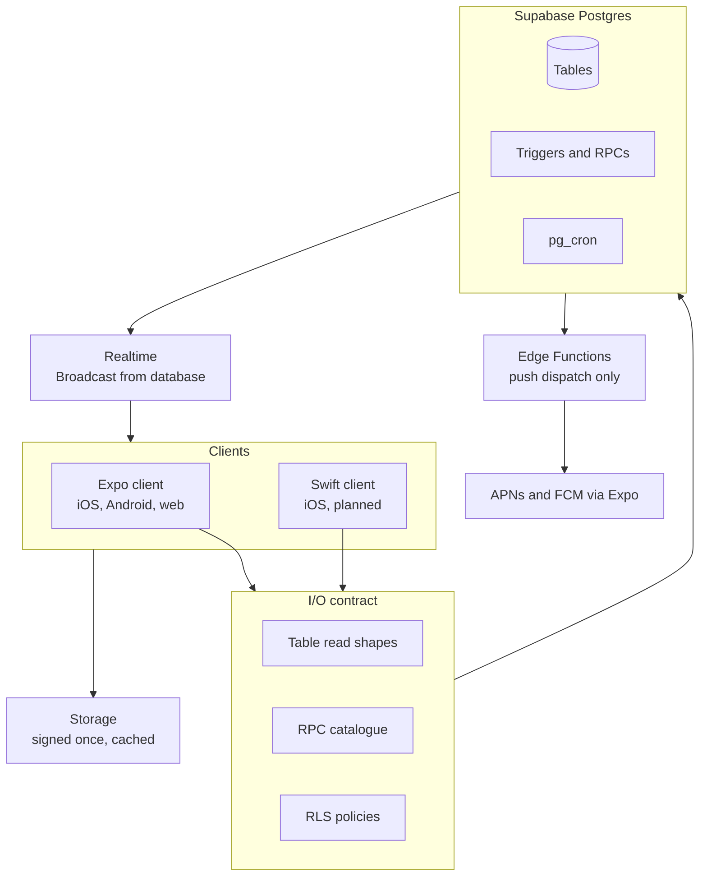

# Backend Design and Plan

The target shape of the ClubChat backend, what changes to get there, and the evidence behind each decision. Written against published vendor limits and the architectures of comparable products, not intuition.

## Verdict

**ClubChat is GroupMe-shaped, not WhatsApp-shaped, and the current architecture is correct.** Keep Postgres as the single source of truth, keep RLS as the only authorization layer, keep the no-application-server design. Supabase's own guidance endorses this shape rather than treating it as a shortcut, and the planned Swift client strengthens the case: two clients sharing one enforcement layer is the architecture's main asset.

Three findings drive everything below.

1. **Storage is not the risk.** Every documented migration off a relational message store happened at 10^8 to 10^12 messages. Discord moved off MongoDB at roughly 100M messages; Signal only ever used Postgres as a transient delivery queue; Zulip runs multi-thousand-organization scale on one Postgres today. ClubChat's realistic ceiling is around 10^6 messages per year. "Chat needs NoSQL" is folklore three to four orders of magnitude away from this product.
2. **The binding constraints are all implementation defects, not architecture.** Unfiltered realtime subscriptions, unwrapped RLS predicates, per-fetch signed URLs, and a sequential calendar feed. Every one is fixable inside the existing design.
3. **Read amplification is the wall, not writes.** One message insert currently causes a full refetch on every connected client in the project. At 200 concurrent users that is roughly 200 PostgREST queries per message sent, each re-running the most expensive policy in the schema. This saturates long before any published Realtime or Postgres limit.

Related: [Architecture](00-architecture.md) · [Security and RLS](02-security-rls.md) · [Realtime and notifications](06-realtime-and-notifications.md) · [Media and storage](07-media-and-storage.md)

## Target architecture

**The contract is the RLS layer plus the RPC catalogue plus documented table read shapes.** There is no API gateway and none is planned. An API tier would duplicate rules that already exist in SQL, creating two sources of truth for authorization; that is a maintainability cost, not a delivery-speed one, which is why the decision survives weighting quality over cost. Edge Functions exist only for outbound work that SQL genuinely cannot do, which today means exactly one thing: push dispatch.

## Phase 0: correctness and launch blockers

Nothing below is optional and none of it is about scale. Each is a defect or a hard gate on the first real club.

| # | Item | Why it is a blocker |
|---|---|---|
| 0.1 | Refetch on every `SUBSCRIBED` transition; set `heartbeatCallback` and `worker: true` in `createClient` | Supabase Realtime's own README states it "does not guarantee that every message will be delivered," and there is no replay after a disconnect. A mobile client backgrounds constantly. Today a resumed app can silently miss messages, which is a correctness bug in a chat product |
| 0.2 | Filter or remove the three project-wide `postgres_changes` subscriptions | `lib/notifications.ts` subscribes to `messages` INSERT with **no filter**, mounted app-wide, so every signed-in user subscribes to every message row in the project. `lib/messages.ts` does the same for `message_reactions` and `message_mentions`. RLS still prevents any data leak, but each insert costs one authorization per subscriber, one billed Realtime message per subscriber, and one full refetch per subscriber |
| 0.3 | Close the message-update authorization gap | A member can pin their own message and retro-flag it as an announcement. Needs a column-scoped UPDATE policy or a `before update` trigger, since the same policy legitimately carries soft-delete and body edits. See [Security and RLS](02-security-rls.md) |
| 0.4 | Widen `is_user_club_admin` to `role in ('admin','owner')` | The fifth instance of a bug that has already shipped four times |
| 0.5 | Configure custom SMTP | The built-in auth email provider is capped at **2 emails per hour, project-wide**. Onboarding a single club breaks it. Even with custom SMTP the default is 30 new users per hour |
| 0.6 | Move to the Pro plan | The free tier has **no automatic backups at all**, one day of log retention, 200 concurrent Realtime connections, no Smart CDN, and pauses after 7 idle days. Not a plan a real club can depend on |
| 0.7 | Pin the local Postgres image to the hosted major version; verify `pg_cron` and `pg_net` are enabled before the first `db push` | Confirmed CLI issues cause `db diff` and `db reset` failures on version skew, and migration `0048` fails outright without `pg_cron` |
| 0.8 | Bound the no-argument `fetchMessages` full-history path | PostgREST's `db-max-rows` silently truncates at 1,000. Highlights will begin missing pins past message 1,000 with no error anywhere |

## Phase 1: the chat backbone

The structural changes that make chat correct and fast, and that pay for themselves in retired complexity.

### 1.1 A `bigint` identity sequence on messages

Add a generated identity column plus an index on `(channel_id, seq desc)`. This is the single highest-leverage schema change available.

It unlocks stable cursor pagination that cannot break on timestamp ties, "give me everything since N" catch-up on reconnect, gap detection, and a cheap unread marker. Zulip uses a globally increasing message id, Telegram a per-channel `pts`, Discord snowflakes; all three depend on it. A global identity column is strictly better here than snowflakes, which exist to generate sortable ids without coordination across shards, and better than a per-channel counter, which needs a row lock per channel and buys nothing at this scale.

Then migrate `fetchMessages` and `fetchMessagesAround` to Zulip's anchor shape: an anchor id or `newest` / `oldest` / `first_unread`, plus `num_before` / `num_after`, returning `found_oldest` / `found_newest` so the client knows whether to keep paging. **This also retires most of the FlatList pagination edge cases already documented in [Engineering pitfalls](12-engineering-pitfalls.md)**, which is a maintainability win independent of performance.

### 1.2 Client-generated idempotency key

`messages.client_id uuid` with `unique(channel_id, client_id)`, inserted `on conflict do nothing ... returning`. The client owns dedup, the server owns ordering. This is GroupMe's `source_guid` and Telegram's `random_id`, and it is the prerequisite for optimistic send and for an outbox.

### 1.3 Rewrite the hot RLS policies

The schema has 127 policies and **124 bare `auth.uid()` call sites, none wrapped in `(select auth.uid())`**. Wrapping forces an initPlan evaluated once per statement rather than once per row; Supabase benchmarks this at 179ms to 9ms.

The harder half: the hottest policy, `messages` SELECT via `is_channel_member(channel_id)`, passes a **row column** as a function argument. Supabase's docs are explicit that such a function cannot be wrapped. A 50-message page evaluates it 50 times with an identical argument, and `stable` permits index usage but does not memoize. The documented remedy is rewriting `helper(row_col)` into set form, `channel_id in (select ... where user_id = auth.uid())`, benchmarked at 9,000ms to 20ms.

Apply to `messages`, `message_reactions`, `message_mentions`, `polls`, `club_posts`, and `notifications`. Wrap `auth.uid()` inside the 35 helper function bodies as a separate, mechanical pass. Run the dashboard Performance Advisor afterward; it has a dedicated check for exactly this.

> This is the one item where correctness risk is real. Every rewritten policy must be verified by impersonation in `psql` before and after, using the technique in [Security and RLS](02-security-rls.md). A policy rewrite that is merely *faster* and subtly *wider* is the worst possible outcome.

### 1.4 Stop signing media URLs per fetch

From Supabase's Smart CDN documentation, verbatim: *"If you generate a new signed URL on every request, the cache will never be warm and every request hits the origin."* Two signed URLs for the same object seconds apart keep independent cache entries.

ClubChat regenerates a signed URL on every fetch, so cache hit rate is zero and every byte is billed as uncached egress at $0.09/GB rather than $0.03/GB. Sign once per object with a long expiry and memoize by storage path. Add `width` and `height` plus a client-generated thumbnail to the message row to eliminate layout shift on load, which is what WhatsApp does.

The honest trade: access degrades from per-user authorization at fetch time to "unguessable until expiry." Club photos are semi-private rather than secret, and this is the pattern every major messenger uses, including Signal, whose blobs are opaque and content-addressed at one stable URL shared by all recipients.

### 1.5 Denormalize and cap unread

Add trigger-maintained `channels.last_message_seq`, so "does this channel have unread" becomes a comparison against one small row that never touches `messages`. Cap the displayed count at 99+ so the underlying COUNT is always `LIMIT`ed. Keep the read-cursor model; it is what Slack and Discord both do, and it cannot drift.

**Do not** adopt fan-out-on-write per-user inbox rows. Zulip has public performance failures from exactly that table, and it is 200x write amplification to answer a question one index scan already answers.

### 1.6 Collapse the calendar feed

`fetchGlobalCalendarFeed` runs the entire per-club chain once per club, and that chain includes one `fetchPolls` per race. A member of three clubs with four races each is roughly 30 sequential round trips against an 8 second statement timeout for the `authenticated` role. Move it into a single Postgres function returning composite JSON. This is precisely the case Supabase names for database functions over client-side composition.

## Phase 2: push notifications

The largest missing capability, and the one the founder named first as an adoption blocker.

**Path:** the `notifications` insert already written by triggers fires a Database Webhook, which calls an Edge Function, which calls Expo's push service. No schema change is needed to attach it, because `body` and `target_path` already exist.

**Three rules that separate a good implementation from a bad one:**

- **Gate on idleness server-side.** Zulip computes the set of recipients who have not interacted with any client in the last few minutes and pushes only to those. This removes most push volume and nearly all duplicate-notification complaints.
- **Evaluate mute at fan-out time.** Client-side muting still consumes the badge and still wakes the device.
- **The server owns the badge integer.** iOS does not compute badges; whatever number is in the payload wins. The server must ship the same unread aggregate the app displays, and must push a decrease when the user reads on another device.

**Token storage:** the official Supabase guide stores a single `profiles.expo_push_token` column. That is wrong for this product. Go per-device from day one, keyed on the token, with platform and `invalidated_at`, and **store raw APNs tokens alongside Expo tokens immediately** so the Swift client can go APNs-direct without a migration. Handle `DeviceNotRegistered` by dropping the token, and check receipts about 15 minutes after send.

**Accept that push is best-effort.** `pg_net` fires after commit, has no documented retry, and stores responses in unlogged tables. That is acceptable here precisely because the in-app Notifications tab is already the durable record, so a lost push is cosmetic rather than a lost message. If that ever stops being true, the upgrade is Supabase Queues, not a rewrite.

## Phase 3: client durability

A local cache of the newest page per channel plus the club and channel list, rendered instantly on cold start, then reconciled with `seq > cached_max`. Then an outbox for pending sends, retrying with the same `client_id`.

Every major messenger keeps history on device; Telegram's client library is literally named for its database. The minimal version here is not full history mirroring, it is "chat opens instantly and a send survives bad reception," which matters on a track with poor signal. This is also the largest perceived-quality win available, and it is identical work whether the client is Expo or Swift.

## Phase 4: only when measured

**Migrate realtime to Broadcast from database.** An AFTER trigger calls `realtime.broadcast_changes()` on a per-channel topic; clients subscribe to private channels where authorization is evaluated **once at join and cached for the connection**, rather than per event per subscriber.

The asymmetry in Supabase's own benchmarks is stark: Postgres Changes with RLS delivers about 30 changes per second at 500 clients and about 5 per second at 3,000, single-threaded so larger compute does not help. Broadcast from database delivers 10,000 messages per second at 80,000 users.

Do this when any of these is true, and not before:

| Signal | Threshold |
|---|---|
| Concurrent Realtime connections | Approaching 500, the Pro quota |
| Changes per second under RLS | Approaching 30 at 500 subscribers |
| Billed Realtime messages | Approaching 5M per month, counted **per listener** |
| Supabase's own stated trigger | ~3,000 concurrent subscribers on the same changes |

Phase 0.2 removes most of the amplification that would otherwise bring these forward, which is why this is Phase 4 rather than Phase 1.

## Deliberately not building

Each of these is a considered rejection, not an oversight.

| Not building | Why |
|---|---|
| Per-message read receipts | O(readers x observers) in a group. No competitor in this category ships them: Slack, Discord and GroupMe have none, and WhatsApp exposes only a coarse all-read aggregate plus an on-demand detail view |
| Presence and online indicators | Slack runs a dedicated service tier for green dots. Near-zero value for a running club |
| End-to-end encryption | Would break search, content-bearing push, moderation, reports, pinned and announcement logic, and every notification trigger in the schema. Signal pays this price deliberately; ClubChat has no threat model that justifies it |
| Sharding, bucketing, or a NoSQL message store | Adopted by Discord at 10^8+ messages and 177 nodes. Three to four orders of magnitude away, and it would cost the joins, RLS and transactional integrity currently free |
| Fan-out-on-write inbox rows | 200x write amplification for something a read cursor answers with one index scan |
| A global update stream (Telegram `pts` style) | Designed for clients tracking thousands of conversations. Per-channel `seq` plus refetch-on-reconnect covers a user in one to five clubs |
| Sliding sync | Solves "my account is in 3,000 rooms" |
| Snowflake IDs | Exist to avoid coordination across shards. One Postgres means `bigint identity` is strictly better |
| An API gateway | Duplicates rules already enforced in RLS, creating a second source of truth for authorization |
| Server-side thumbnail pipelines | Client-side thumbnails cover the value at a fraction of the complexity |

## Where this stack stops being right

Concrete exit signals, distinct from the Phase 4 tier change, which is a Supabase feature rather than a platform exit.

- **RLS becomes the cost, not the missing optimization**: chat page loads still exceed roughly 500ms p95 after the set-form rewrite and indexing, or any normal-load query hits the 8 second `authenticated` timeout.
- **Authorization needs privileged computation**: rate-limit counters, moderation scores, abuse heuristics. RLS filters rows; it cannot compute side effects the client must never see.
- **The two clients need different authorization semantics for the same table.** Today they share one layer, which is the design's core strength. The moment that stops being true, the shared layer becomes a liability.
- **A lost push becomes a product failure rather than a cosmetic one.** That requires guaranteed fan-out, which means a worker, not an Edge Function.

Explicitly **not** reasons to leave: connection counts (PostgREST is stateless, a mobile fleet costs WebSockets rather than Postgres connections), having many RPCs (Supabase recommends this shape), or the arrival of the Swift client (it strengthens the case for shared RLS).

## Invariants

1. **Postgres is the single source of truth.** Realtime is a delivery optimization and is best-effort by the vendor's own statement; every client must be able to reconstruct correct state by refetching.
2. **Authorization lives in RLS and definer RPCs, never in a client and never in a middleware tier.** Both clients bind to the same layer.
3. **No realtime subscription may be unfiltered.** Every subscription is scoped to a channel, a club, or a user.
4. **A signed storage URL is generated once per object and reused**, never per fetch.
5. **Any policy rewrite is verified by `psql` impersonation before and after.** Faster and subtly wider is worse than slow.
6. **Push is best-effort; the in-app notification record is durable.** No product behaviour may depend on a push arriving.

## Known gaps

- No rate limiting anywhere. A member can spam messages, reports, reactions and join requests as fast as the network allows.
- No error monitoring. Sentry via the community supabase-js integration is the documented path and works for the Swift client through Sentry's own SDK.
- Storage objects are excluded from database backups on every plan, and no cleanup path exists, so deleting a message orphans its file.
- No staging environment. Supabase Branching gives each PR its own instance and is the natural fit, since most of the logic here is RLS and trigger shaped and only testable against real Postgres.
- A Supabase outage is a total outage with no degraded mode, which is the price of having no application server.

## Evidence

Published vendor limits and benchmarks were fetched 2026-07-24. Comparable-product architecture is drawn from primary engineering sources: Discord's storage posts, Telegram's update protocol specification, Zulip's subsystem documentation, Slack's real-time messaging post, and GroupMe's v3 API reference. Where sources disagreed or a number could not be confirmed against a primary source, it is not stated here as fact.

Two widely repeated claims were checked and found unsupported: that chat workloads require a NoSQL store below roughly 10^9 messages, and that GroupMe caps groups at 500 members, which appears only in help-center text and not in the API reference.
